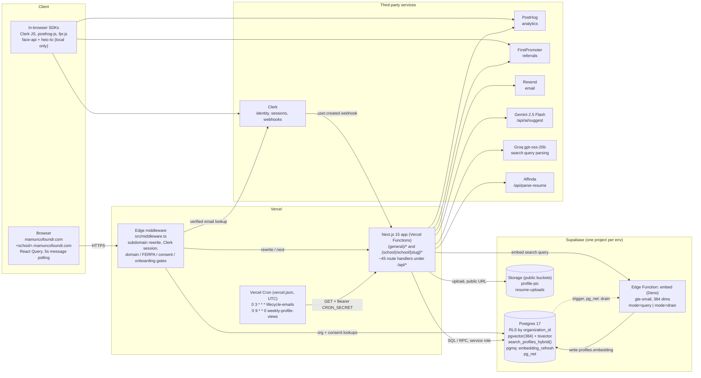
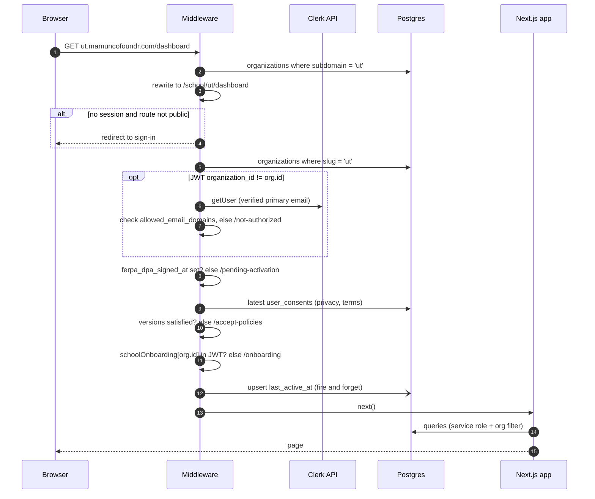
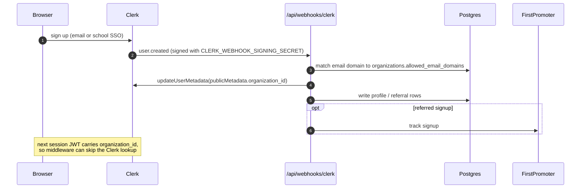
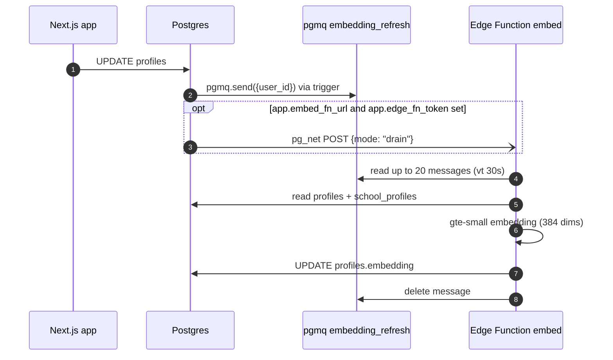
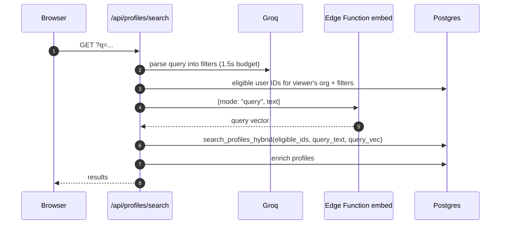
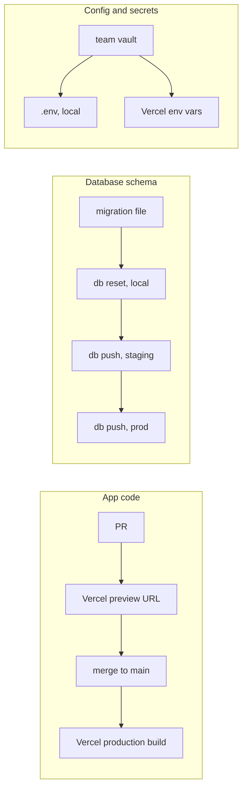

# Deployment overview

How Mamun Co-Foundr is deployed and how the pieces talk to each other.

> Derived from the repo at `934418c`. Vercel project settings, the Supabase dashboard
> config, and DNS are not in the repo, so details about them are inferred and marked as such.
> Known issues found while mapping this are tracked in
> [`DEPLOYMENT_FINDINGS.md`](./DEPLOYMENT_FINDINGS.md).

## At a glance

- **One Next.js 15 app on Vercel** serves both the general site (`mamuncofoundr.com`) and
  every school tenant (`<school>.mamuncofoundr.com`).
- **Edge middleware** (`src/middleware.ts`) resolves the tenant and gates access before any
  page code runs.
- **Supabase** holds the data (Postgres 17), files (Storage), and embeddings (the `embed`
  Edge Function).
- **Clerk** owns identity. Org membership lives in Clerk `publicMetadata` and is read from
  the session JWT.
- **Third-party APIs** are called from route handlers or loaded as browser SDKs.

## System diagram

## Components

### Vercel

| Component | Where | Role |
| --- | --- | --- |
| Edge middleware | `src/middleware.ts` | Rewrites `.mamuncofoundr.com/*` to `/school/<slug>/*`, enforces Clerk auth, runs school gates, upserts `user_activity_summary.last_active_at`. |
| Next.js app | `src/app/**` | Pages for the general site and school tenants; ~45 route handlers under `src/app/api/`. Thin shells over `src/features/*` (see [`ARCHITECTURE.md`](./ARCHITECTURE.md)). |
| Cron | `vercel.json` | Calls `/api/cron/lifecycle-emails` daily at 03:00 UTC and `/api/cron/weekly-profile-views` Sundays at 09:00 UTC. Routes check `Authorization: Bearer CRON_SECRET`. |
| Image proxy | `next.config.ts` | `next/image` is allowed to fetch public objects from the two Supabase project hosts. |

### Supabase

| Component | Where | Role |
| --- | --- | --- |
| Postgres 17 | `supabase/migrations/*.sql` | All app data. RLS scopes rows by `organization_id`. Extensions: `vector`, `pgcrypto`, `pg_net`, `pgmq`. |
| Hybrid search | `search_profiles_hybrid()` | Fuses full-text (`search_tsv`), vector (`embedding`), and partial-name matches with reciprocal rank fusion. |
| Embedding queue | `enqueue_embedding_refresh()` trigger | On profile change, sends `{user_id}` to pgmq `embedding_refresh`, then POSTs `{mode: "drain"}` to the Edge Function via `pg_net` if `app.embed_fn_url` and `app.edge_fn_token` are set. |
| Edge Function `embed` | `supabase/functions/embed/index.ts` | `mode=query` embeds a search string; `mode=drain` processes up to 20 queue messages and writes `profiles.embedding`. |
| Storage | `profile-pic`, `resume-uploads` | Written by `/api/upload-profile-pic` and `/api/upload-resume`. Both return public URLs. |

### Supabase clients in the app

| Client | Where | RLS |
| --- | --- | --- |
| Service role | `createClient(url, SUPABASE_SERVICE_ROLE_KEY)` in most routes and middleware | Bypassed. Isolation relies on app-layer `organization_id` filters. |
| User token | `createServerSupabaseClient()` in `src/lib/supabaseServer.ts` | Enforced. Requires Clerk third-party auth enabled on the hosted Supabase project. |

The browser never talks to Supabase directly. All data access goes through route handlers.

### Third-party services

| Service | Called from | Purpose |
| --- | --- | --- |
| Clerk | Browser SDK, middleware, `/api/webhooks/clerk` | Sign-in/up (incl. school SSO), session JWT with `organization_id` and onboarding flags, `user.created` webhook. |
| Resend | `src/lib/email/*`, cron routes | Match, invite, and message notifications; lifecycle and weekly digest emails. |
| Gemini 2.5 Flash | `/api/ai/suggest` | Profile writing suggestions. |
| Groq (`openai/gpt-oss-20b`) | `src/lib/searchQueryParser.ts` | Turns search text into structured filters; 1.5s timeout. |
| Affinda (us1, v3) | `/api/parse-resume` | Parses uploaded resumes to prefill onboarding. |
| PostHog | `posthog-js` in browser, `posthog-node` on server | Product analytics. |
| FirstPromoter | `fpr.js` in browser, Clerk webhook | Referral tracking; signups reported from the webhook. |

## Key request paths

### School page request

### Sign-up and tenant assignment

### Profile edit to embedding refresh

### Natural-language search

### Scheduled jobs

| Schedule (UTC) | Route | Does |
| --- | --- | --- |
| `0 3 * * *` | `/api/cron/lifecycle-emails` | Profile-completion reminders and re-engagement emails (`src/lib/email/lifecycle/`). |
| `0 9 * * 0` | `/api/cron/weekly-profile-views` | Weekly profile-view digests. |
| not scheduled | `/api/cron/sync-posthog-activity` | Syncs PostHog activity into `user_activity_summary`. Route exists, no entry in `vercel.json`. |

## Environments

| Env | App | Database | Auth | Schema changes |
| --- | --- | --- | --- | --- |
| Local | `npm run dev` (`next dev --turbopack`) | Supabase in Docker: API `:54321`, Postgres `:54322`, Studio `:54323`; seeded from `supabase/seed.sql` | Clerk dev instance | `supabase db reset` |
| Staging | Vercel preview deployments (inferred) | Supabase cloud, shared dev project | Clerk dev instance | `supabase link` then `supabase db push`, by hand |
| Prod | Vercel production, apex + wildcard subdomains (inferred) | Supabase cloud, prod project | Clerk prod instance | `supabase link` then `supabase db push`, by hand |

See [`DATABASE_MIGRATIONS.md`](./DATABASE_MIGRATIONS.md) for the full migration workflow.

## Release flow

- App code deploys through Vercel's Git integration. There is no `.github/workflows`, so lint,
  tests, and type checks run only when someone runs them locally.
- Migrations, the `embed` Edge Function, and the `app.embed_fn_url` / `app.edge_fn_token` DB
  settings are deployed separately with the Supabase CLI or dashboard.
- The two pipelines are not coordinated. See finding F-2 in
  [`DEPLOYMENT_FINDINGS.md`](./DEPLOYMENT_FINDINGS.md).

## Environment variables

Names only. Values live in the team vault and in Vercel project settings.

| Group | Variables |
| --- | --- |
| Supabase | `NEXT_PUBLIC_SUPABASE_URL`, `NEXT_PUBLIC_SUPABASE_KEY`, `SUPABASE_SERVICE_ROLE_KEY` |
| Clerk | `NEXT_PUBLIC_CLERK_PUBLISHABLE_KEY`, `CLERK_SECRET_KEY`, `CLERK_WEBHOOK_SIGNING_SECRET`, `NEXT_PUBLIC_CLERK_SIGN_IN_FALLBACK_REDIRECT_URL`, `NEXT_PUBLIC_CLERK_SIGN_UP_FALLBACK_REDIRECT_URL` |
| Email | `RESEND_API_KEY` |
| AI | `GEMINI_API_KEY`, `GROQ_API_KEY` |
| Resume parsing | `AFFINDA_API_KEY`, `AFFINDA_WORKSPACE_ID`, `AFFINDA_DOCUMENT_TYPE_ID` |
| Analytics | `NEXT_PUBLIC_POSTHOG_KEY`, `NEXT_PUBLIC_POSTHOG_HOST`, `NEXT_PUBLIC_POSTHOG_PROJECT_ID`, `POSTHOG_PERSONAL_API_KEY` |
| Referrals | `FIRSTPROMOTER_API_KEY`, `NEXT_PUBLIC_FIRSTPROMOTER_ACCOUNT_ID` |
| App | `NEXT_PUBLIC_APP_URL`, `NEXT_PUBLIC_BASE_URL`, `NEXT_PUBLIC_PRODUCTION_URL`, `NEXT_PUBLIC_MAMUN_ACCESS_CODE`, `ADMIN_EMAILS`, `CRON_SECRET` |
| Edge Function (Supabase-managed) | `SUPABASE_URL`, `SUPABASE_SERVICE_ROLE_KEY` |
