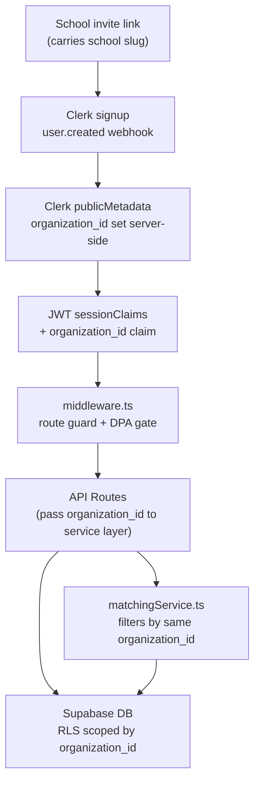

# School Tenant Isolation Plan

## Current State

The app has no multi-tenancy. All profiles share a single Postgres namespace, the matching service scores across all users globally, and auth (Clerk) has no org-level concept in use today.

Key files to change:

- `[src/middleware.ts](src/middleware.ts)` — route protection & onboarding gate
- `[src/features/matching/matchingService.ts](src/features/matching/matchingService.ts)` — candidate scoring and filtering
- `[src/app/api/profiles/route.ts](src/app/api/profiles/route.ts)` — profile feed (queue + scoring)
- `[types/global.d.ts](types/global.d.ts)` — shared TypeScript types
- `[supabase/](supabase/)` — RLS policies and migrations

---

## Architecture: Clerk User Metadata + DB `organization_id`



- **NULL `organization_id`** = general CoFoundr pool (existing users unaffected)
- **Non-null `organization_id`** = school user, scoped to that school only
- School users **never appear in** and **never see** the general pool, and cannot see other schools

---

## Layer 1 — Database

### New `organizations` table

```sql
CREATE TABLE organizations (
  id                  uuid PRIMARY KEY DEFAULT gen_random_uuid(),
  name                text NOT NULL,
  slug                text UNIQUE NOT NULL,
  type                text NOT NULL DEFAULT 'school',
  ferpa_dpa_signed_at timestamptz,  -- must be non-null before students can log in
  settings            jsonb DEFAULT '{}',
  created_at          timestamptz DEFAULT now()
);
```

### Add `organization_id` to `profiles`

```sql
ALTER TABLE profiles
  ADD COLUMN organization_id uuid REFERENCES organizations(id);

CREATE INDEX idx_profiles_organization_id ON profiles(organization_id);
```

### Update RLS policies

All existing `profiles` SELECT/UPDATE policies get a clause:

```sql
-- General pool users see only null-org profiles
-- School users see only profiles with their org_id
(organization_id IS NULL AND auth.jwt() ->> 'org_id' IS NULL)
OR
(organization_id = (auth.jwt() ->> 'org_id')::uuid)
```

Apply the same scoping to `likes`, `user_profile_actions`, `matching_queue`, `conversations`, `conversation_participants`, and `messages`.

---

## Layer 2 — Auth (Clerk User Metadata)

No Clerk Organizations needed. School membership is stored directly on the Clerk user via `publicMetadata`:

- Each school gets a **unique invite link** containing a `school` query param (e.g. `?school=mit`)
- The existing `user.created` webhook (`/api/webhooks/clerk`) is extended: if the signup originated from a school invite link, call the Clerk backend API to set `publicMetadata.organization_id = '<supabase-org-uuid>'` on the new user
- Add a **custom JWT claim** in Clerk's JWT template to forward this value into the session token:

```json
{ "organization_id": "{{user.public_metadata.organization_id}}" }
```

- Update `CustomJwtSessionClaims` in `[types/global.d.ts](types/global.d.ts)`:

```ts
interface CustomJwtSessionClaims {
  metadata: { onboardingComplete?: boolean; organization_id?: string };
}
```

`organization_id` is `undefined` for all existing general CoFoundr users — no changes needed for them.

---

## Layer 3 — Middleware

`[src/middleware.ts](src/middleware.ts)` currently checks `onboardingComplete`. Add:

1. If `sessionClaims.metadata.organization_id` is present, verify the matching `organizations` row has `ferpa_dpa_signed_at IS NOT NULL` (school is fully onboarded). If not, redirect to a "school pending activation" page.
2. School users bypass the general `/onboarding` if the school provides a simplified or pre-filled onboarding.
3. Optionally, route `/:schoolSlug/*` path prefix to school-specific pages.

---

## Layer 4 — Matching Service

`[src/features/matching/matchingService.ts](src/features/matching/matchingService.ts)` and `[src/app/api/profiles/route.ts](src/app/api/profiles/route.ts)`:

- Read `organizationId` directly from `sessionClaims.metadata.organization_id` — no DB lookup needed since it's already the Supabase UUID
- Add a hard filter: candidates must share the same `organization_id`
- General users (`organization_id` is undefined) still see only the general pool

```ts
// In profiles API route
const orgId = sessionClaims?.metadata?.organization_id ?? null;
const candidates = await getCandidates({ viewerUserId, organizationId: orgId });
```

---

## Layer 5 — FERPA Compliance

FERPA treats student profile data as "education records." Controls required:

- **Data Processing Agreement (DPA):** tracked via `organizations.ferpa_dpa_signed_at`; no student can log in until this is signed. This is a legal/operational step, not just a code step.
- **No cross-org data flow:** enforced by RLS + service-layer `organization_id` filter. School users cannot be surfaced to general users or other schools.
- **Data minimization:** school onboarding should only collect fields needed for the matching use case; avoid collecting sensitive fields not relevant to schools (e.g. hide general startup-funding fields if not applicable).
- **Deletion rights:** the existing `/api/delete-profile` route already handles this; ensure it also cascades any school-specific tables.
- **Audit logging:** add an `audit_log` table (or use PostHog events already in place) to record profile data access by school admins.
- **No sale of student data:** ensure PostHog, Resend, and other third-party integrations do not receive student PII. Consider a flag on `organizations` to suppress third-party tracking for school users.
- **Access by school admins:** school staff can be given a separate Clerk user with `publicMetadata.organization_id` set + an `is_school_admin: true` flag in metadata, scoped to view only their school's profiles.

---

## Scalability to 10 Schools

- Each school = 1 row in `organizations` — completely additive, no schema changes per school, no Clerk plan upgrade
- RLS handles isolation automatically for every new school
- The matching service change is a single filter predicate, not per-school logic
- New schools are onboarded via: insert `organizations` row → sign DPA (set `ferpa_dpa_signed_at`) → generate school invite link → students sign up, webhook sets their `publicMetadata.organization_id`

---

---

## Layer 6 — Frontend Route Separation

### Route Group Structure

Use Next.js App Router route groups to give school users a completely separate layout and page set without a separate deployment:

```
src/app/
├── (general)/              ← existing CoFoundr experience (move current pages here)
│   ├── layout.tsx          ← general nav, pricing table, referral banners
│   ├── dashboard/
│   ├── profile/
│   ├── matches/
│   └── ...
└── (school)/               ← school experience
    ├── layout.tsx          ← school nav, no pricing/referrals, school branding
    └── [slug]/
        ├── dashboard/
        ├── profile/
        ├── matches/
        └── onboarding/
```

Shared UI building blocks stay in `src/components/` and are imported by both layouts. School-specific components go in `src/components/school/`.

### Middleware Enforcement

`[src/middleware.ts](src/middleware.ts)` gets two additional redirect rules:

```ts
const orgId = sessionClaims?.metadata?.organization_id;
const isSchoolRoute = pathname.startsWith("/school/");

// School user trying to access general routes → redirect to school dashboard
if (orgId && !isSchoolRoute) {
  const slug = await resolveSlug(orgId); // lookup organizations.slug
  return NextResponse.redirect(`/school/${slug}/dashboard`);
}

// General user trying to access school routes → redirect to general dashboard
if (!orgId && isSchoolRoute) {
  return NextResponse.redirect("/dashboard");
}
```

### Future Subdomain Upgrade (Zero Code Change)

When a school wants `mit.cofoundr.com`, add a single Vercel rewrite in `vercel.json`:

```json
{
  "rewrites": [
    {
      "source": "/:path*",
      "destination": "/school/mit/:path*",
      "has": [{ "type": "host", "value": "mit.cofoundr.com" }]
    }
  ]
}
```

No app code changes required — the route group structure already supports it.

---

## What Does NOT Change

- General CoFoundr users are unaffected (`organization_id IS NULL` everywhere)
- Existing API routes continue to work; `organizationId` defaults to `null`
- No separate deployment or Supabase project needed
